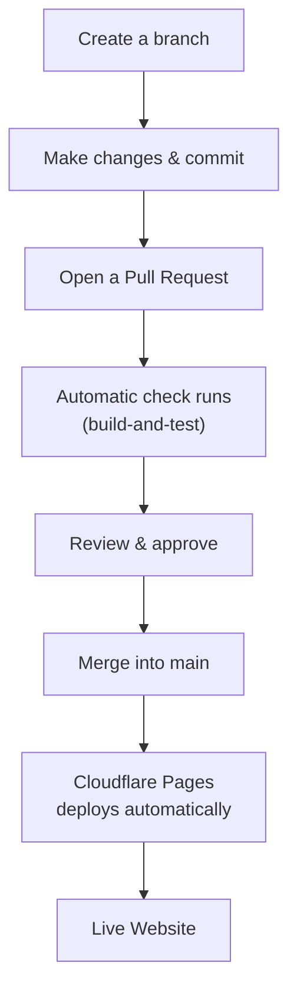
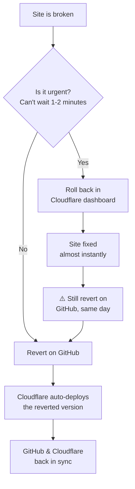

# Contributing to JiTpro-Website

## Purpose

This document explains how changes are made to the JiTpro marketing website, from a first edit to going live, and the safeguards in place to protect the live site from accidental changes.

## How a Change Reaches the Live Site

Changes are never made directly on `main`. Every change goes through a branch, a Pull Request, and an automatic check before it can be merged and published.

## Branch Naming

| Prefix | Use for | Example |
|---|---|---|
| `feature/` | New functionality | `feature/homepage-update` |
| `fix/` | Bug fixes | `fix/contact-form-error` |
| `chore/` | Maintenance, config, dependency updates | `chore/update-nvmrc` |
| `docs/` | Documentation only | `docs/update-contributing` |
|

## Node.js Version

The project's Node.js version is pinned in `.nvmrc` (currently **24**). This keeps local development, the GitHub automatic check, and Cloudflare's build environment all using the same version.

> 📌 **Reminder:** Review the Node.js version every 1–2 years. Check [nodejs.org/en/about/previous-releases](https://nodejs.org/en/about/previous-releases) for end-of-life dates, and update `.nvmrc` if the current version is nearing retirement.

## Continuous Integration (CI)

Every Pull Request automatically runs a check called **build-and-test**. It runs the same commands defined in `package.json`, so if it passes here, it behaves the same way locally. A Pull Request cannot be merged until this check passes.

The check covers:

| Check | What it catches | Blocks merging? |
|---|---|---|
| Type checking & linting | Coding mistakes and formatting issues | ✅ Yes |
| Unit tests (`npm test`, Vitest) | A logic regression in a tested module (for example the lead-magnet registries or validation) | ✅ Yes |
| Build | The site fails to build | ✅ Yes |
| Dependency audit (`audit-ci`) | A newly introduced High/Critical severity vulnerability | ✅ Yes |
| Broken links, images & files | A dead internal link, missing image, or missing file | ✅ Yes |
|

As of July 2026, this check uses `audit-ci` instead of plain `npm audit`, so specific, reviewed vulnerabilities can be knowingly excepted (documented, not silently ignored) rather than blocking every future change until fully fixed. Nothing is currently excepted, the allowlist is empty.

## Branch Protection (`main`)

| Setting | Status |
|---|---|
| Pull Request required before merging | ✅ On |
| `build-and-test` check required | ✅ On |
| Direct pushes to `main` | ⛔ Blocked |
| Force pushes | ⛔ Blocked |
| Signed commits / required code scanning | ⬜ Off *(not needed for a single-owner repo)* |
|

## Security Scanning

| Feature | Status | What it does |
|---|---|---|
| Secret scanning (detects leaked passwords/keys) | ✅ On | Flags a secret after it's already been pushed |
| Secret validity checks | ✅ On | Automatically checks whether a found secret is still active or already dead |
| AI-based secret detection | ✅ On | Catches secrets that don't match a known, recognizable pattern |
| Push protection | ✅ On | Blocks the push before a secret ever reaches GitHub, not just after |
| Dependabot vulnerability alerts | ✅ On | |
| Dependabot malware alerts | ✅ On | |
| Direct dismissal of Dependabot alerts | ⛔ Blocked | Requires a request instead |
|

Dependabot catches vulnerable dependencies over time. The `audit-ci` step in CI (see above) adds a second layer, catching a High/Critical vulnerability the moment it's introduced by any Pull Request, not just Dependabot's own.

**Push Protection:** blocks a commit containing a detected secret from being pushed at all, rather than flagging it after the fact. Works alongside the two other protections enabled at the same time (validity checks, AI-based detection).

## Dependency Updates ("Bumps")

GitHub automatically opens Pull Requests (via **Dependabot**) when a package the site relies on has an update available, especially for security fixes. Each one runs through the same check and review process as any other change.

- **Patch/minor updates** (e.g. `5.4.20 → 5.4.21`) are usually safe to merge after a quick check.
- **Major updates** (e.g. `5.x → 8.x`) can include breaking changes and need closer review. Sometimes fixing one package's vulnerability requires an unrelated tool to be updated too (for example, a Tailwind CSS security fix once required upgrading Tailwind itself from v3 to v4). When this happens, it's worth pausing to review the change carefully, including a full visual check of the site, before merging, rather than rushing it through.

> ⚠️ **A word choice worth being careful about:** if a PR only *allowlists* a vulnerability (defers it, doesn't actually fix it), don't write `Closes #__` in the description, that auto-closes the tracking Issue even though the real fix hasn't happened yet. This actually happened once (Issue #22 closed itself two weeks before the real fix landed). Use `Relates to #__` instead for anything that isn't the genuine, complete fix.

## Cloudflare Deployment

Merging into `main` automatically deploys the live website at **jit-pro.com**. Every open Pull Request also gets its own **preview link**, so changes can be reviewed before going live.

> ⚠️ **Note:** The contact form's "Verify you are human" step only works on the live site, not on preview links. Test everything else on the preview link, then confirm the form once the change is live.

## Note: A Former Second Deployment

This repo used to also publish to GitHub Pages, at `jitprolabs.github.io/JiTpro-Website/`, via a separate workflow (`deploy.yml`) that predated the current Cloudflare setup. Jeff confirmed it was no longer needed, so it was removed and the GitHub Pages site was unpublished. **Cloudflare Pages, serving jit-pro.com, is the one and only deployment.** If you ever see a reference to the old GitHub Pages URL somewhere, it's stale, it no longer resolves.

## Uptime & Domain Monitoring

The live site is monitored 24/7 by [Pulsetic](https://pulsetic.com) (free tier), checking every 5 minutes:

| Monitor | Checks |
|---|---|
| `jit-pro.com` | Uptime, SSL certificate |
| `www.jit-pro.com` | Uptime, SSL certificate |
| `jitpro-website.pages.dev` | Uptime, SSL certificate (Cloudflare's direct address, useful for telling apart a domain-specific issue from a platform-wide one) |
| Domain registration (`jit-pro.com`) | Expiry, currently registered through June 2029 |
|

> 📌 **Note:** On the free tier, alerts currently go to Tech@jit-pro.com. Adding a second recipient, or switching to a shared distribution list once one exists, needs a small paid add-on (~$8-9/mo). Worth revisiting once the alerts@ list is set up.

## Rolling Back a Bad Deploy

Since Cloudflare Pages automatically deploys from `main` on every merge, `main` is always the single source of truth for what should be live. This means the standard, correct way to undo a bad change is on GitHub, not in Cloudflare's dashboard.

### The right way: revert on GitHub

1. Go to **Pull requests** → click the **Closed** tab (merged PRs move here, they won't show under "Open")
2. Find the PR that caused the problem, newest merged PRs appear first
3. Open it, click **Revert**
4. This automatically opens a new PR that undoes the change
5. Wait for the `build-and-test` check to pass (usually 20–30 seconds)
6. Click **Squash and merge**
7. Cloudflare automatically redeploys the reverted version

This takes about 1–2 minutes total, and `main` and the live site never fall out of sync, GitHub stays the single source of truth the entire time.

### If it needs to happen right now: Cloudflare rollback

If something is actively harmful and even a minute or two is too long to wait, there's a faster option: **Cloudflare → Workers & Pages → the `jitpro-website` project → Deployments tab.** Every previous deploy is listed there; find the last one that was working and roll back to it. This takes effect almost immediately.

> ⚠️ **Important: this is a stopgap, not a fix.** Rolling back in Cloudflare only changes what's currently being *served*, it does not change what's in GitHub. `main` still shows the bad change as the latest commit. If nothing else is done, the *next* time anything triggers a new deploy (another merge, even a manual retry), Cloudflare will rebuild from `main` exactly as it was and silently undo the rollback, bringing the bad version right back.
>
> **If you use this option, you must still complete "The right way" above, the same day**, so GitHub and Cloudflare agree again. Once that revert PR merges, the two are back in sync for good, until the next time a rollback is needed.

## Automated Deployment Cleanup

Old Cloudflare Pages deployments for this project are cleaned up
automatically, on a weekly schedule, by a separate project:
[jitpro-deployment-cleanup](https://github.com/JiTproLabs/jitpro-deployment-cleanup).

In short: preview deployments are deleted about 7 days after their PR
closes, and production deployments beyond the newest 30 are deleted,
except the one currently live. If a deployment you expected to still
exist has disappeared, this is very likely why. See that repo's
README for the full rules and how to adjust them.

## One-Time Setup (Completed)

- [x] CI check added (`build-and-test`)
- [x] `.nvmrc` added (pins Node.js version)
- [x] Branch protection active on `main`
- [x] Pull Request + status check required to merge
- [x] Force pushes blocked
- [x] Dependabot alerts + malware alerts enabled
- [x] Direct dismissal of Dependabot alerts disabled
- [x] Dependency security audit added to CI (now `audit-ci`, supports reviewed exceptions)
- [x] Broken link/image/file check added to CI
- [x] Tailwind CSS upgraded to v4 (resolved a High-severity vulnerability)
- [x] All known dependency vulnerabilities resolved
- [x] GitHub Pages mirror removed and unpublished
- [x] Uptime, SSL, and domain-expiry monitoring set up (Pulsetic)

## Future Ideas (Not Yet Implemented)

- Staging environment + multiple PR reviewers *(worth adding if a second contributor joins; not needed for a single-owner repo)*
- Second alert recipient for monitoring (requires a paid Pulsetic plan)

## Repository Info

| | |
|---|---|
| Repository | [JiTproLabs/JiTpro-Website](https://github.com/JiTproLabs/JiTpro-Website) |
| Live site | [jit-pro.com](https://jit-pro.com) |
| Default branch | `main` |
| Hosting / Deployment | Cloudflare Pages |
| Node.js version | 24 (see `.nvmrc`) |
| Last updated | September 12, 2026 |
|
