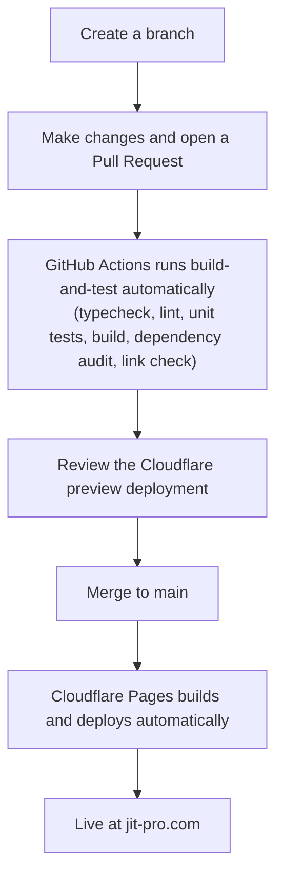

# JiTpro Marketing Website: Operations

This document covers everything needed to own, monitor, and maintain the JiTpro
marketing website and its supporting infrastructure. It is written for Jeff
(account owner), technical contributors, and anyone onboarding to this project.

**Keep this document up to date.** When a setting changes, a new service is added,
or a decision is made, update this document in the same PR. A stale operations
document is worse than none.

Last reviewed: September 2026

---

## 1. What exists

Everything involved in running the marketing website.

| Resource | What it is | Who owns it |
|---|---|---|
| GitHub `JiTproLabs/JiTpro-Website` | The website source code | JiTproLabs org |
| GitHub Actions `build-and-test` | Automated checks on every PR | JiTproLabs org |
| GitHub Actions `node-check-reminder` | Annual reminder to review the Node.js version | JiTproLabs org |
| GitHub Actions `annual-security-txt-reminder` | Annual reminder to renew the security.txt expiry date | JiTproLabs org |
| Cloudflare Pages `jitpro-website` | Hosts and deploys the built website | Tech@jit-pro.com account |
| Cloudflare `jit-pro.com` zone | Manages the domain, DNS, SSL, and security | Tech@jit-pro.com account |
| Cloudflare Workers `jitpro-deployment-cleanup` | Weekly cleanup of old Cloudflare Pages deployments | Tech@jit-pro.com account |
| Pulsetic | External uptime monitoring, checks the site every 5 minutes | JiTpro |
| Supabase `jitpro_website` | Backend database and Edge Functions for the website | JiTpro |
| Resend | Transactional email sending for contact form and lead magnet | JiTpro |
| Google Search Console | Google search visibility and indexing | JiTpro |

---

## 2. The canonical address

**`https://jit-pro.com` is the canonical address of the site.**

`www.jit-pro.com` redirects to it with a 301, using a Cloudflare Redirect Rule
deployed September 2026. Both hostnames are active Cloudflare Pages custom
domains, and the redirect is what makes the apex authoritative.

This matters for three reasons:

- Google indexes the apex address, so anything measuring search performance must
  use the `jit-pro.com` Domain property in Search Console, not the `www` one.
- The lead-capture Edge Function allows both hostnames as request origins, as a
  safety net. If the redirect is ever removed or reordered, a visitor arriving at
  `www` would still be able to submit the form. The redirect remains the primary
  control.
- Anything else that lists site addresses, including a future sitemap, should use
  the apex form.

**Do not remove the redirect rule** without understanding what depends on it.

---

## 3. How the site gets from code to live

Every change follows this path:

**Rules that protect the live site:**
- Nobody pushes directly to `main`. Every change goes through a Pull Request.
- The `build-and-test` check must pass before merging is allowed.
- A failed build on Cloudflare never becomes the live site.

**If something goes wrong after a deployment:**
See the [rollback section in CONTRIBUTING.md](./CONTRIBUTING.md#rolling-back-a-bad-deploy).

---

## 4. Cloudflare configuration

### 4.1 Pages project `jitpro-website`

| Setting | Value | Why |
|---|---|---|
| Git repository | `JiTproLabs/JiTpro-Website` | GitHub is the single source of truth |
| Production branch | `main` | Only merges to main deploy to the live site |
| Build command | `npm run build` | Standard Vite build |
| Build output | `dist` | Standard Vite output directory |
| Automatic deployments | Enabled | Every merge to main deploys automatically |
| Variables and secrets | None | The site is static with no server-side secrets needed in Cloudflare |
| Preview access | Public | Previews are for reviewing changes and contain no sensitive content |

### 4.2 Domain and DNS `jit-pro.com`

The domain DNS is fully managed through Cloudflare. Nameservers:
- `damian.ns.cloudflare.com`
- `karina.ns.cloudflare.com`

Key DNS records:

| Subdomain | Points to | Purpose |
|---|---|---|
| `jit-pro.com` | `jitpro-website.pages.dev` | Apex, the canonical address |
| `www.jit-pro.com` | `jitpro-website.pages.dev` | Redirects to the apex, see section 2 |
| Microsoft 365 records | Microsoft servers | Email and Teams, do not touch |
| Amazon SES records | Amazon servers | Transactional email sending, do not touch |

**Do not delete or modify DNS records without understanding what they do.**
The Microsoft 365 and Amazon SES records are required for email to work.

### 4.3 Redirect rules

One rule exists, under Cloudflare Rules:

| Rule | Behaviour |
|---|---|
| `https://www.jit-pro.com/*` to `https://jit-pro.com/${1}` | 301, query string preserved |

See section 2 for why it matters.

### 4.4 SSL/TLS

| Setting | Value | Why |
|---|---|---|
| Encryption mode | Full (strict) | Cloudflare verifies the certificate between itself and Pages. This is the strongest free setting. Cloudflare Pages always has a valid certificate so there is no reason to use a weaker mode. |

**Do not change this setting.**

### 4.5 DNSSEC

DNSSEC is enabled. It adds a cryptographic signature to DNS records so that
when someone looks up `jit-pro.com`, the answer cannot be tampered with by
a third party. Enabled September 2026. Cloudflare manages this automatically.

### 4.6 Security settings

These are on and should stay on:

| Setting | Status | What it does |
|---|---|---|
| Cloudflare managed ruleset | Always active | Built-in protection against common web attacks |
| HTTP DDoS protection | Always active | Automatic flood protection |
| Browser integrity check | On | Checks browser headers for threats |
| Email address obfuscation | On | Hides email addresses from scrapers |
| Replace insecure JS libraries | On | Replaces known vulnerable libraries automatically |
| Remove X-Powered-By headers | On | Removes server information from responses |
| Add security headers | On | Adds cross-site scripting protection headers |

No custom security rules, rate limiting rules, or managed rules are configured,
and none are needed. The site is static, so the attack surface those rules
protect does not exist here. The lead-capture form has its own rate limiting
inside the Supabase Edge Function.

**Bot Fight Mode: do not enable.**
Pulsetic monitors the site by sending automated requests every 5 minutes.
On the Free plan, Bot Fight Mode cannot be configured to allow exceptions,
and it runs before any allow list, so exceptions would never be reached.
It would block Pulsetic and cause false downtime alerts. Reviewed September
2026. Revisit if the account upgrades to a paid Cloudflare plan where
exceptions can be configured.

**AI Labyrinth: do not enable.**
The marketing site needs to be found and read by search engines and AI
assistants. Blocking crawlers works against that goal.

### 4.7 AI crawler policies

| Category | Setting | Why |
|---|---|---|
| Search | Allow | Google, Bing, and Apple must be able to index the site |
| Agent | Allow | AI assistants can reference the site when answering user questions |
| Training | Disallow | Content cannot be used to train AI models without permission |
| Bot Preference Sync | On | Cloudflare reflects these settings to crawlers |

Reviewed and confirmed September 2026 following Cloudflare's automatic migration.

Note: the site has no `robots.txt` file of its own. See section 8.

### 4.8 Notifications

All notifications send to `Tech@jit-pro.com`.

| Notification | What triggers it | What to do when it arrives |
|---|---|---|
| Cloudflare Incident Alert | Cloudflare infrastructure has a problem | Check what the incident affects. Most incidents affect products the marketing site does not use. If Pages is not listed, the site is likely unaffected. Wait for the resolved notification. |
| JiTpro Website Deployment Alert | A production deployment succeeds or fails | If success, no action needed. If failure, check the Deployments tab in the jitpro-website Pages project for the error. |
| JiTpro SSL Certificate Alert | The SSL certificate has a renewal problem | Go to Cloudflare, then jit-pro.com, then SSL/TLS. Cloudflare renews certificates automatically. This alert means the automatic renewal hit a problem. Contact Cloudflare support if it does not resolve within 24 hours. |
| JiTpro Abuse Report Alert | An abuse report is filed against jit-pro.com | Review the report immediately. Contact Cloudflare if the report is incorrect. |

### 4.9 Deployment cleanup Worker

The `jitpro-deployment-cleanup` Worker runs every Wednesday at 16:00 UTC and
deletes old Cloudflare Pages deployments automatically. A summary email is sent
to `Tech@jit-pro.com` after every run. See the
[jitpro-deployment-cleanup README](https://github.com/JiTproLabs/jitpro-deployment-cleanup)
for full details, cleanup rules, and how to adjust settings.

---

## 5. Google Search Console

Two properties exist. Both are owned by `tech@jit-pro.com`.

| Property | Covers | Use it? |
|---|---|---|
| `jit-pro.com` (Domain) | The apex, www, http, https, and any subdomain | **Yes, this is the one to use** |
| `https://www.jit-pro.com` (URL prefix) | The www address only | No, kept only because removing it gains nothing |

The `www` property was created first, before we established that the site
redirects to the apex. It shows almost no data because the address it watches
redirects away. The Domain property is the correct one for anything that
matters.

---

## 6. Where to look when something happens

| Situation | Where to look first | What to do |
|---|---|---|
| Website is down | Pulsetic alert email | Check if a Cloudflare Incident Alert also arrived. If yes, it is a Cloudflare problem, wait for resolution. If no, check the Deployments tab in the jitpro-website Pages project for a failed deployment. |
| Deployment failed | GitHub Actions tab or Cloudflare deployment alert email | Look at the build-and-test check in GitHub. If CI passed but Cloudflare failed, check the Deployments tab in the jitpro-website Pages project. |
| SSL certificate problem | Cloudflare SSL alert email | Go to Cloudflare, then jit-pro.com, then SSL/TLS. Contact Cloudflare support if it does not resolve within 24 hours. |
| Cloudflare is having a problem | Cloudflare Incident Alert email | Check [cloudflarestatus.com](https://www.cloudflarestatus.com) for details. Wait for the resolved notification. |
| Abuse report filed | Cloudflare Abuse Alert email | Review the report immediately. Contact Cloudflare if the report is incorrect. |
| CI check failed on a PR | GitHub email notification | Open the PR, click the failing check, read the error. Fix before merging. |
| Cleanup Worker failed | Email from `no-reply@mail.jit-pro.com` | Check the Deployments tab in the jitpro-deployment-cleanup Worker for error details. |
| Traffic dropped significantly | Cloudflare Web Analytics | Check if Pulsetic also alerted. Check Google Search Console for indexing problems. |
| Google search visibility problem | Google Search Console, Domain property | Review coverage errors and any manual actions flagged. See section 8 for the known gap. |

---

## 7. Monitoring model

| Tool | What it monitors | How it alerts |
|---|---|---|
| Pulsetic | Site uptime at `jit-pro.com`, `www.jit-pro.com`, and `jitpro-website.pages.dev`. SSL certificate validity. Domain registration expiry (registered until June 2029). | Email to `Tech@jit-pro.com` |
| Cloudflare Notifications | Deployment success and failure. SSL certificate problems. Cloudflare infrastructure incidents. Abuse reports. | Email to `Tech@jit-pro.com` |
| GitHub Actions | Code quality including typecheck, lint, tests, build, dependency audit, and broken links. | Email to the PR author |
| Cloudflare Web Analytics | Visitors, page views, popular pages, Core Web Vitals performance. Enabled on the Pages project. | Check manually, no automatic alerts |
| Google Search Console | Google indexing, search visibility, crawl errors. | Email for critical issues, check manually monthly |
| Cleanup Worker | Weekly summary of deployments deleted. | Email to `Tech@jit-pro.com` every Wednesday |

**The model in plain English:**
No alerts arriving means everything is working. You do not need to log into
any system unless an alert arrives or your monthly check is due.

---

## 8. Known gaps

Things that are understood, diagnosed, and not yet fixed. Recorded here so
nobody rediscovers them from scratch.

### Search engines can only find the homepage

The homepage is indexed by Google. Every inner page checked in September 2026,
including `/field-guide`, `/learn-more` and `/contact`, came back as unknown to
Google. Never crawled.

The cause is not a misconfiguration. The site is a client-rendered single-page
application, so the HTML Google first receives is an empty shell and the links
only appear after JavaScript runs. That rendering happens in a queue that can
lag by hours or longer, and in practice Google has not followed the links.

The fix is a `sitemap.xml` listing every public page, plus a `robots.txt`
pointing at it. Neither file exists today. Requesting each page manually in
Search Console works as a stopgap but does not scale.

This is deliberately deferred until the site's page list is settled, because a
sitemap written against pages that are about to change would be stale
immediately.

### Any unknown address returns the homepage

`public/_redirects` ends with a catch-all that serves `index.html` for anything
with no matching file. That is what makes client-side routing work, but it also
means a mistyped or removed address returns the homepage with a 200 rather than
a 404. Google's own audit of `robots.txt` reported errors for exactly this
reason: the file does not exist, so the homepage HTML was served instead.

Real files always win over the catch-all, which is why the Field Guide PDF at
`/guides/...` works correctly. Adding `robots.txt` and `sitemap.xml` as real
files under `public/` will make them resolve properly.

### Owned by Jeff

| Item | Note |
|---|---|
| Image optimisation | Hero images are served larger than needed, which is the main cause of slow page loads on mobile. Tracked in the repository issues. |
| Site metadata | Page titles, meta descriptions, and Open Graph tags for social sharing. Needed for LinkedIn previews of `/field-guide`. |

---

## 9. Monthly 15-minute check

Once a month, log into each system and do a quick visual check.
This catches slow or silent problems that alerts do not cover.

| System | What to look at | Where |
|---|---|---|
| Cloudflare Web Analytics | Any unusual drop or spike in visits or page views | Cloudflare, then jit-pro.com, then Analytics, then Web Analytics |
| Cloudflare Security | Any unusual spike in mitigated traffic | Cloudflare, then jit-pro.com, then Security, then Analytics |
| Pulsetic | Uptime percentage, should be close to 100% | Pulsetic dashboard |
| Google Search Console | Any new coverage errors or drop in impressions | Google Search Console, Domain property |
| Cleanup Worker email | Confirm the Wednesday email arrived the past few weeks | Tech@jit-pro.com inbox |
| GitHub Dependabot | Any open security alerts on the repository | GitHub, then JiTproLabs/JiTpro-Website, then Security tab |

---

## 10. Annual maintenance

Two GitHub Actions workflows each create a maintenance issue once a year. Both
can also be run manually from the Actions tab.

| Workflow | Runs | What it reminds you to do |
|---|---|---|
| [`node-check-reminder.yml`](../.github/workflows/node-check-reminder.yml) | January 15th | Review the Node.js LTS release and end-of-life dates, update `.nvmrc` if needed, confirm GitHub Actions and Cloudflare Pages use the expected version, and run typecheck, lint and build |
| [`annual-security-txt-reminder.yml`](../.github/workflows/annual-security-txt-reminder.yml) | September 1st | Update the `Expires` date in `public/.well-known/security.txt` to one year ahead |

They are deliberately separate workflows because the two tasks are unrelated.
Each creates its own issue with its own checklist, and neither creates a
duplicate if one is already open.

---

## 11. Key contacts and access

| System | Access |
|---|---|
| Cloudflare | Tech@jit-pro.com, account owner |
| GitHub | JiTproLabs organisation |
| Pulsetic | Tech@jit-pro.com |
| Supabase | JiTpro account |
| Resend | JiTpro account |
| Google Search Console | Tech@jit-pro.com owns both properties, contributors added as users |

**Domain registration:** `jit-pro.com` is registered through June 2029.
Pulsetic monitors domain expiry and will alert before it lapses.
